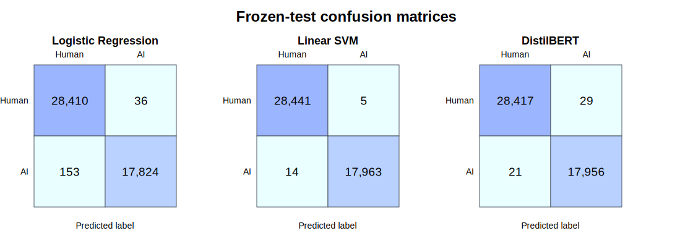
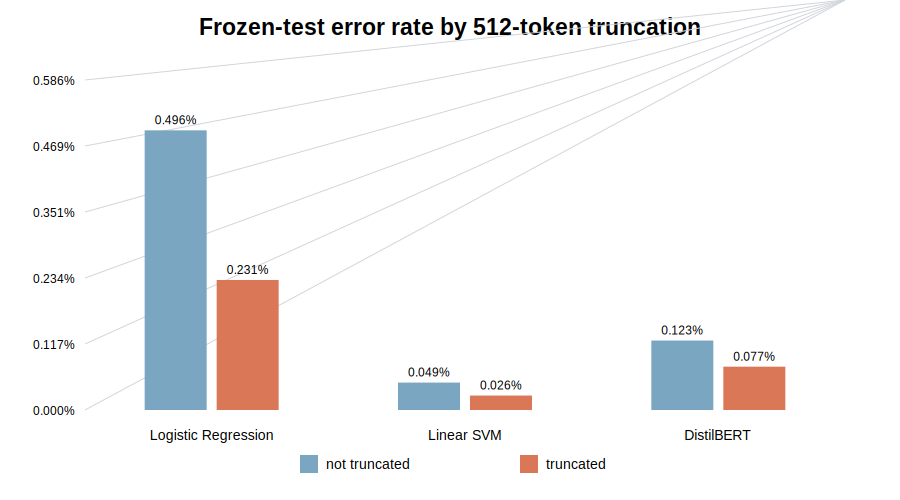

# Frozen-Test Error Analysis

## Scope and safeguards

This analysis uses the final predictions saved after the model configuration and frozen-test
comparison were complete. It does not change preprocessing, model parameters, thresholds,
checkpoint selection, or reported test metrics. The input prediction artifact is verified by
SHA-256 before analysis:

`11b6e98055bd0aeef177c5202b2478c3dc7c689218a2e66afb70853e1e413422`

Prepared test rows are aligned to predictions by the original `source_row_id`, and their
labels must match. Untruncated DistilBERT token lengths are measured locally so rows that
actually exceed the 512-token limit can be analyzed separately. Compact 500-character
excerpts are saved only for rows misclassified by at least one model.

## Overall errors

| Model | False positives | False negatives | Total errors | Error rate |
| --- | ---: | ---: | ---: | ---: |
| Linear SVM | 5 | 14 | 19 | 0.0409% |
| DistilBERT | 29 | 21 | 50 | 0.1077% |
| Logistic Regression | 36 | 153 | 189 | 0.4071% |



Only 223 of 46,423 test rows were misclassified by any model. Error overlap was limited:

| Models wrong on row | Rows |
| --- | ---: |
| Logistic Regression only | 165 |
| DistilBERT only | 27 |
| Logistic Regression + DistilBERT | 12 |
| All three models | 8 |
| Linear SVM only | 4 |
| Logistic Regression + Linear SVM | 4 |
| Linear SVM + DistilBERT | 3 |

The small eight-row intersection shows that the models do not simply fail on one common
hard subset. Linear SVM made the fewest errors, and 15 of its 19 errors were also made by at
least one other model.

## Class-specific behavior

Logistic Regression was much more likely to miss AI-generated rows than to flag human rows:
its AI-class error rate was 0.8511%, compared with 0.1266% for human text. Linear SVM showed
the same direction at much lower rates (0.0779% versus 0.0176%). DistilBERT was more balanced,
with error rates of 0.1168% for AI-generated text and 0.1019% for human text.

This distinction matters operationally. Logistic Regression's high overall precision hides
the fact that most of its residual errors are false negatives. DistilBERT has 132 fewer
false negatives than Logistic Regression, but 24 more false positives than Linear SVM.

## Length and truncation

The test split contains 15,600 rows (33.604%) whose untruncated token length exceeds 512.
This closely matches the training and validation truncation fractions and confirms that
context loss is a material architectural limitation.

However, errors were not concentrated in truncated rows:

| Model | Non-truncated error rate | Truncated error rate | Truncated errors |
| --- | ---: | ---: | ---: |
| Logistic Regression | 0.4964% | 0.2308% | 36 |
| Linear SVM | 0.0487% | 0.0256% | 4 |
| DistilBERT | 0.1233% | 0.0769% | 12 |



These are descriptive slice results, not evidence that truncation improves prediction.
Text length, label prevalence, topic, and generator characteristics may differ between the
slices. DistilBERT's truncated-slice F1 was slightly lower (0.998388 versus 0.998668) even
though its raw error rate was lower. The correct conclusion is that truncation did not drive
most observed errors on this dataset, while the model still cannot use text beyond its first
512 tokens.

Very short text was a clearer problem for the classic models. Among the 155 rows with at
most 100 words, Logistic Regression made 8 errors (5.1613%) and Linear SVM made 1 (0.6452%);
DistilBERT made none. The single SVM error was a nine-word AI-labeled subject line
(`source_row_id=80931`), which provides very little lexical evidence for a TF-IDF classifier.
Because this slice is small, its rate should be reported with its support rather than treated
as a stable population estimate.

## Opening style and formulaic essays

Opening style was assigned descriptively before aggregation: a salutation, a question mark
within the first 150 normalized characters, or other. Opening-question rows were harder for
every model:

| Model | Opening-question error rate | Other-opening error rate | Ratio |
| --- | ---: | ---: | ---: |
| Logistic Regression | 0.8237% | 0.3691% | 2.23× |
| Linear SVM | 0.1236% | 0.0328% | 3.77× |
| DistilBERT | 0.2883% | 0.0902% | 3.20× |

Qualitative review supports a cautious interpretation: both classes contain formulaic school
essays using rhetorical questions, direct address, repeated reasons, and principal-facing
prompts. DistilBERT false positives include human-labeled essays beginning with constructions
such as “Dear Principal” or “Have you ever...,” while several Logistic Regression false
negatives are AI-labeled texts written in personal, error-filled student-essay prose. The
models appear to rely partly on style and prompt-family cues that occur in both labels.

## Confidence and disagreement

DistilBERT was frequently confident when wrong. Its median probability assigned to the
incorrect predicted class was 0.995132; 44 of 50 errors were at least 0.90 confident and 28
were at least 0.99 confident. Logistic Regression's median wrong-class confidence was
0.672666, with 33 of 189 errors at least 0.90 and only one at least 0.99. Linear SVM scores
are uncalibrated decision margins and should not be compared directly with probabilities;
its median absolute margin on errors was 0.141564.

High confidence on these in-distribution errors is a warning against treating the
DistilBERT probability as a reliable real-world certainty estimate. Calibration was not a
preselected project objective and must not be tuned on this frozen test set.

## Related-text families

Manual review found visibly near-parallel essay families among the errors. Examples include
human-labeled school-lunch and outdoor-activity essays with character substitutions, and
AI-labeled decision-making essays with nearly identical structure and wording. Some members
of these families receive the same error from multiple models.

The preparation workflow removed exact duplicates after lowercasing, URL removal, and
whitespace normalization. It was not designed to remove semantic paraphrases or
character-level perturbations. The reviewed examples establish that related text families
exist within the test errors; they do **not** by themselves prove that a related training
example crossed the split boundary. A future robustness study should use near-duplicate or
prompt-family grouping before splitting and then retrain from scratch on that new split.
That study would be a new experiment, not a revision of the frozen test result.

## Limitations and implications

- Near-ceiling performance, especially from TF-IDF + Linear SVM, likely reflects strong
  dataset, prompt, or generator artifacts. It is not evidence that general AI-text detection
  is solved.
- The evaluation covers one deduplicated dataset and one frozen random split. It does not
  test unseen generators, newer model families, editing by humans, mixed-authorship text,
  other genres, or distribution shift.
- DistilBERT discards content after 512 tokens for 33.604% of test examples. Its strong score
  cannot show that omitted later content was irrelevant outside this dataset.
- DistilBERT's high-confidence errors show that confidence is not a sufficient safeguard.
- Dataset labels are treated as ground truth for this project. Error analysis cannot
  independently verify authorship or resolve possible labeling ambiguity.
- The qualitative categories are exploratory summaries of frozen errors. They were not
  prespecified hypothesis tests and should not be presented as causal findings.
- No thresholds, models, or preprocessing steps were changed after test evaluation.

These limitations support a human-in-the-loop interpretation. A detector score could guide
review or research, but it should not be used alone to accuse a student, impose discipline,
or claim authorship. The final report should lead with the frozen comparison while making
its narrow dataset scope equally prominent.

## Reusable outputs

- `results/frozen_error_analysis_by_model.csv`: metrics, confusion counts, and error-score
  strength summaries.
- `results/frozen_error_analysis_slices.csv`: fixed truncation, word-length, label, and
  opening-style slices with support and error rates.
- `results/frozen_error_overlap.csv`: mutually exclusive model-error intersections.
- `results/frozen_error_examples.csv.gz`: 223 unique error rows with compact excerpts and
  all model outcomes/scores.
- `results/frozen_error_analysis.json`: input hash, alignment policy, truncation count, and
  output manifest.

Run the reproducible analysis with:

```powershell
python -m src.analyze_frozen_errors --overwrite
```

The explicit flag is required because the verified outputs are version-controlled and the
workflow stages a complete replacement before changing them.
