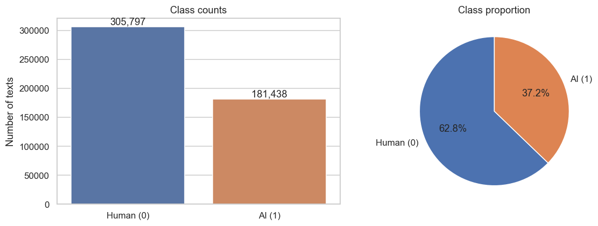
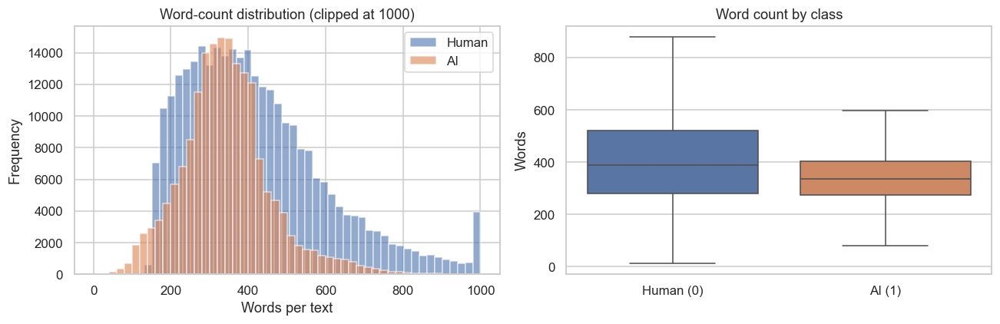
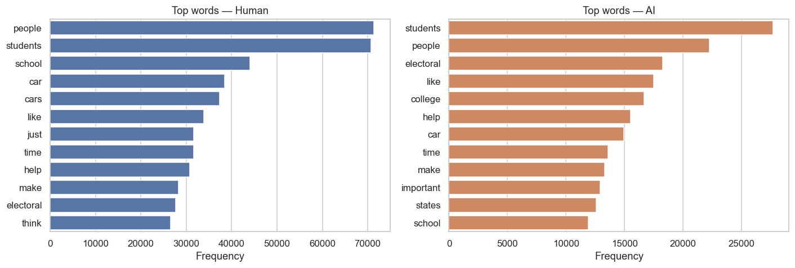
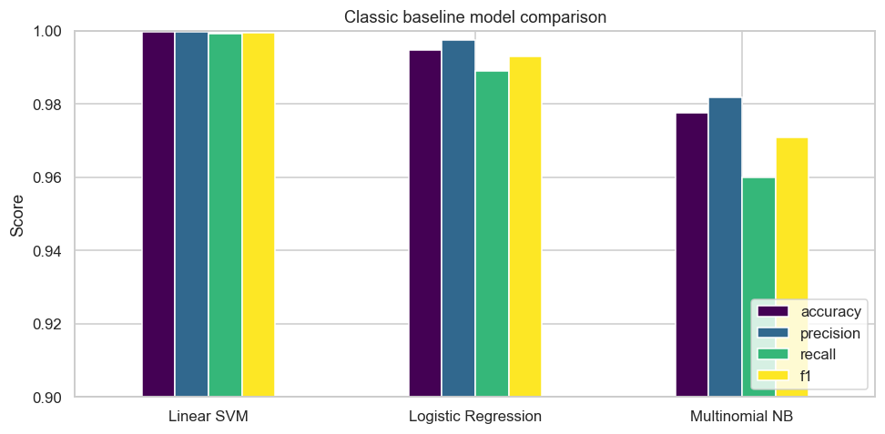
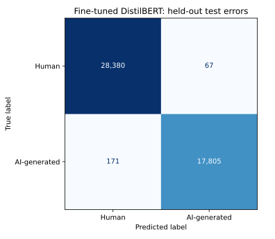
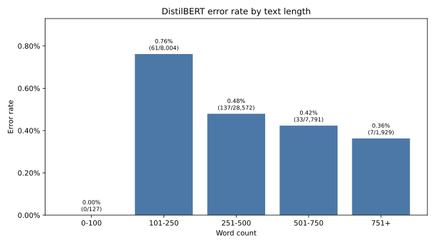
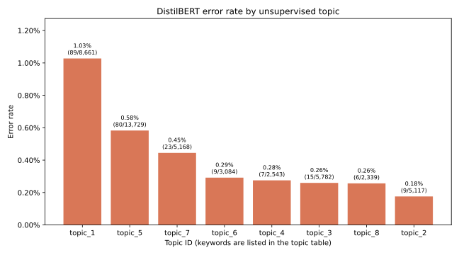

# Detecting AI-Generated Text: Final Report

SEA 820 NLP Final Project. Team: George and Kasra.

## 1. Introduction

Large Language Models have made machine-generated text hard to tell apart from human writing. This matters for academic integrity, content moderation, and misinformation. The goal of this project is to build, evaluate, and compare NLP models that classify a piece of text as human-written or AI-generated.

We compare two families of models on the same data. The first is a classic baseline that uses TF-IDF features with linear classifiers. The second is a fine-tuned Transformer, DistilBERT. We report accuracy, precision, recall, and F1, run a detailed error analysis on the best Transformer, and discuss the ethical risks of deploying this kind of detector.

The main finding is that the task is easy to score highly on this dataset but hard to solve in a way that generalizes. The strongest model is the classic Linear SVM, and the fine-tuned Transformer does not beat it. The near-perfect scores appear to come from dataset and generator artifacts rather than a robust signal of authorship, which we return to in the error analysis and ethics sections.

## 2. Dataset

We use the AI vs Human Text dataset from Kaggle (`shanegerami/ai-vs-human-text`). Each row has a `text` field and a `generated` label, where `0` is human-written and `1` is AI-generated.

Verified facts from the raw file:

- 487,235 total rows.
- 305,797 human rows and 181,438 AI-generated rows, about 63 percent human and 37 percent AI.
- No missing values in `text` or `generated`.
- No exact duplicate texts, 4 empty or whitespace-only texts, and 23,004 cleaned-text duplicates.

The class imbalance is mild but real, so we use stratified splits and treat F1 for the AI-generated class as the primary metric rather than accuracy alone.

## 3. Exploratory Data Analysis

The texts are essays. The median length is 363 words and the 75th percentile is 471 words, with a mean of about 393 words and 2,270 characters.

Length differs by class. Human essays are longer on average (mean 422 words, median 389) than AI essays (mean 344 words, median 337), but the distributions overlap heavily. Length on its own is only mildly discriminative, so we do not expect it to explain a near-perfect classifier.

The vocabulary is large. The most frequent content words are almost the same for both classes (`people`, `students`, `school`, `car`, `electoral`, `college`), which shows the two classes share the same prompt topics. This overlap is important later: because both classes write about the same subjects, topic words are weak evidence of authorship, and a model that scores highly is likely keying on style and surface patterns instead.

Cleaning is light. We remove empty rows, collapse repeated whitespace, and de-duplicate on a normalized key before splitting.

## 4. Methodology

### 4.1 Preprocessing and splitting

We build a normalized deduplication key by lowercasing the text, removing URLs, and collapsing whitespace, then drop duplicate rows by that key before any split. De-duplicating before the split prevents formatting-only variants from leaking across train and test.

We use a stratified 80/10/10 train, validation, and test split with `random_state=42`. After cleaning and de-duplication, 464,227 usable rows remain, split into 371,381 train, 46,423 validation, and 46,423 test rows. Every split keeps the same class balance of about 61 percent human and 39 percent AI-generated. The test split is held out and only used for the final comparison.

### 4.2 Classic baseline

The classic baseline uses TF-IDF features with linear classifiers, following the Week 1 setup. Text is lowercased, URLs are stripped, and whitespace is collapsed. The `TfidfVectorizer` uses unigrams and bigrams, English stop-word removal, `min_df=5`, `max_features=50000`, and `sublinear_tf=True`.

We train three classic models: Logistic Regression, Multinomial Naive Bayes, and a Linear SVM. Logistic Regression is the required baseline, and the other two are included for comparison. The strongest classic model sets the score the Transformer must beat.

### 4.3 Transformer

The Transformer is `distilbert-base-uncased`, fine-tuned with the Hugging Face `Trainer` API. Transformer preprocessing stays minimal: we drop empty texts and collapse whitespace but keep punctuation, capitalization, and stop words, because those are cues a Transformer can use. Text is tokenized with the pretrained DistilBERT tokenizer, truncated to a maximum length, and padded dynamically per batch with `DataCollatorWithPadding`.

We set the maximum sequence length to 256 tokens. This is a practical choice for training time on the available GPU, and we track its impact in the error analysis, because a large share of essays are longer than 256 tokens.

## 5. Experiments

We ran four controlled fine-tuning experiments that each change one hyperparameter, using a fixed stratified subset of 8,000 training and 2,000 validation rows to keep the search affordable.

| Run | Learning rate | Batch size | Epochs | Validation F1 |
| --- | ---: | ---: | ---: | ---: |
| B | 5e-5 | 4 | 1 | 0.9820 |
| D | 2e-5 | 4 | 2 | 0.9808 |
| C | 2e-5 | 8 | 1 | 0.9776 |
| A | 2e-5 | 4 | 1 | 0.9733 |

Run B, with the larger learning rate of 5e-5, had the highest validation F1 and was selected before any test evaluation. The larger learning rate helped most; a second epoch (Run D) and a larger batch size (Run C) both helped less than raising the learning rate.

The selected configuration was then trained on the full 371,381-row training split for one epoch. On the validation split it reached accuracy 0.9948 and F1 0.9933. Training took about 1.5 hours on an NVIDIA RTX 3060 laptop GPU.

## 6. Results and Model Comparison

All models are scored on the same 46,423-row held-out test split. The classic models are refit on the same training rows and evaluated on the same test rows as DistilBERT, so the comparison is fair rather than a comparison across different splits.

| Model | Accuracy | Precision | Recall | F1 |
| --- | ---: | ---: | ---: | ---: |
| TF-IDF + Linear SVM | 0.9995 | 0.9998 | 0.9989 | 0.9994 |
| Fine-tuned DistilBERT | 0.9949 | 0.9963 | 0.9905 | 0.9934 |
| TF-IDF + Logistic Regression | 0.9944 | 0.9974 | 0.9882 | 0.9927 |

The Linear SVM is the strongest model by every metric, with an F1 of 0.9994. The fine-tuned DistilBERT reaches F1 0.9934, which does not beat the Linear SVM and only roughly matches Logistic Regression. On this dataset, a linear model over TF-IDF features that trains in minutes on a CPU outperforms a Transformer that takes about 1.5 hours to fine-tune on a GPU.

This result is the opposite of what the effort put into each model might suggest, and it is the central point of the analysis. When a simple linear model already scores near the ceiling, there is little headroom for a Transformer to improve, and the gap between the two is within the range that dataset-specific patterns can produce. We do not read this as evidence that Transformers are weak. We read it as evidence that this classification task is being solved by shallow, dataset-specific cues that a linear model captures just as well.

## 7. Model Behavior

To see what the classic model learns, we inspect the Logistic Regression coefficients.

The most AI-indicative tokens are formal connectors and essay-structure words: `important`, `essay`, `additionally`, `conclusion`, `firstly`, `significant`, `essential`, `ensure`, and `privacy`. The most human-indicative tokens are informal or prompt-specific words: `going`, `kids`, `paragraph`, `percent`, `said`, `probably`, `driving`, `electors`, and `venus`.

This is a useful and slightly uncomfortable result. The model is not detecting authorship in a general sense. It is detecting a register. AI essays in this dataset tend to use polished connectors and explicit structure, while the human essays tend to use informal phrasing, spelling variants, and prompt-specific vocabulary. A classifier that keys on `additionally` and `firstly` will work well here, but it encodes a stylistic stereotype rather than a reliable authorship signal, and that stereotype is exactly what raises the fairness concerns discussed in the ethics section.

## 8. Error Analysis

The error analysis uses the fine-tuned DistilBERT predictions on the 46,423-row test split. No model, threshold, or preprocessing rule was changed during analysis.

### 8.1 Overall mistakes

DistilBERT made 238 errors: 67 false positives and 171 false negatives, for an overall error rate of 0.51 percent. Errors are asymmetric. The AI-generated class had an error rate of 0.95 percent, compared with 0.24 percent for human text, so the model was more likely to miss an AI essay than to flag a human essay by mistake.

The mistakes were usually confident. The median probability assigned to the wrong predicted class was 0.998, 217 of the 238 errors (91 percent) were at least 0.90 confident, and 192 (81 percent) were at least 0.99 confident. A high DistilBERT probability is therefore not reliable evidence of authorship, which is important for any real deployment.

### 8.2 Text length and truncation

| Word count | Support | Error rate | False positives | False negatives |
| --- | ---: | ---: | ---: | ---: |
| 0 to 100 | 127 | 0.00% | 0 | 0 |
| 101 to 250 | 8,004 | 0.76% | 12 | 49 |
| 251 to 500 | 28,572 | 0.48% | 21 | 116 |
| 501 to 750 | 7,791 | 0.42% | 27 | 6 |
| 751 or more | 1,929 | 0.36% | 7 | 0 |

The very shortest essays had no errors, but that bin has only 127 rows, so it is too small to support a claim that short text is easy. Moderately short essays of 101 to 250 words were the hardest group, and their errors were mostly false negatives. Longer essays had a different error mix: nearly all errors above 500 words were false positives, where long and well-organized human essays resemble the fluent structure the model associates with generated text.

About 89 percent of test essays were longer than 256 tokens and were truncated. Truncated rows had a slightly lower error rate (0.50 percent) than non-truncated rows (0.61 percent), so truncation does not explain most mistakes. It does mean the model reaches near-perfect scores while reading only the first 256 tokens of most essays, which is further evidence that it relies on early, surface-level cues rather than full-document understanding.

### 8.3 Topic and writing style

Using unsupervised NMF topics that do not use labels or predictions, the highest error rates fall on general-opinion essays (1.03 percent) and school essays (0.58 percent). Together these two topics account for 169 of the 238 errors, about 71 percent. These are broad, heterogeneous topics with fewer topic-specific cues, which fits the idea that the model leans on prompt and style patterns.

By opening style, essays that begin with a question had the highest error rate (0.72 percent), mostly false negatives, while essays that open with a salutation had the lowest (0.24 percent). Rhetorical questions and direct-address school essays appear in both classes, so they are weak authorship evidence even though they are recurring cues.

### 8.4 Representative errors

False positives are human essays predicted as AI. Examples include an encyclopedic Mars summary whose explanatory format resembles generated prose, and an informal school letter whose formulaic argument structure outweighs its spelling errors. These cases show that grammatical mistakes do not reliably protect human text from being flagged.

False negatives are AI essays predicted as human. Examples include a simple student-voice letter about the Electoral College, a personal anecdote full of character substitutions, and a rhetorical-question school essay. Character corruption and a simple student voice make generated text look human.

The test set also contains near-parallel essays that share a prompt structure with small perturbations. This does not prove train and test leakage, since exact de-duplication was applied, but it shows that prompt families and mechanical text changes are important characteristics of the dataset that a random split does not fully separate.

### 8.5 Why the model fails

The evidence supports four cautious explanations. Prompt and topic cues overlap across classes, so school letters and formulaic arguments appear in both. Artificial-looking corruption weakens authorship cues in both directions. The model relies on dataset-specific regularities, shown by its very high confidence on wrong predictions. Near-parallel text families are hard for a random split to separate cleanly. Testing these causally would require a new experiment with prompt-family grouping and evaluation on unseen generators.

## 9. Ethical Discussion

The results connect directly to the ethics of deploying an AI-text detector.

The clearest risk is harm to non-native English speakers. Section 7 shows the classic model keys on formal connectors and explicit essay structure to mark text as AI. Many non-native writers are taught to write with exactly these connectors and structures. A detector trained on this data could disproportionately flag competent non-native writing as machine-generated, which in an academic setting means false accusations against students who did nothing wrong.

The confidence pattern makes this worse. In the error analysis, 81 percent of the mistakes were made with at least 0.99 confidence. A detector that is confidently wrong is dangerous, because downstream users, such as instructors or moderation systems, are likely to trust a high score. Presenting these outputs as proof of authorship would be misleading. The scores describe this dataset, not a universal test of who wrote a text.

There is also dataset and generator bias. The dataset draws on a narrow set of prompts (school essays, the Electoral College, driverless cars, Mars) and a limited set of generators. The models learn artifacts of those prompts and generators, including specific phrasings and even character-corruption patterns, rather than a general property of AI text. A detector this good on this data would likely fail on text from a different generator or a different genre, so a near-perfect score here should not be marketed as a reliable product.

Finally, the two error types carry different costs. A false positive can wrongly penalize a human writer, while a false negative lets AI text pass as human. Our best Transformer made more false negatives than false positives, but in an academic-integrity setting the false positives are the more serious harm, because they damage individual students. Any real use of a detector should treat its output as a weak signal for human review, never as an automatic judgment.

## 10. Limitations

This study uses one dataset with a limited set of prompts and generators, so the results may not transfer to other sources of AI text. We fine-tuned one Transformer for one epoch at a 256-token limit, so a larger model, more epochs, or a longer sequence length could change the Transformer numbers, though the classic baseline leaves little headroom to beat. The topic and style findings are associations, not causes, and the near-parallel prompt families mean a random split does not fully isolate unseen writing.

## 11. Conclusion

We built and compared classic and Transformer models for detecting AI-generated text. On a shared held-out test split, the strongest model is the classic TF-IDF Linear SVM with an F1 of 0.9994, and the fine-tuned DistilBERT (F1 0.9934) does not beat it and roughly matches Logistic Regression. The scores are near-perfect, but the error analysis and feature inspection show that this reflects dataset and generator artifacts rather than a robust signal of authorship. The model keys on register and surface cues, is confidently wrong when it fails, and reads only the first part of most essays.

The practical takeaway is twofold. First, a simple linear baseline is a strong and efficient choice for this task, and a Transformer is not required to reach the ceiling on this data. Second, and more important, a high score here does not mean AI-text detection is solved. A detector built on this data would risk flagging non-native writers and would likely fail on new generators, so it should be treated as a weak signal for human review rather than a reliable judgment of authorship.
